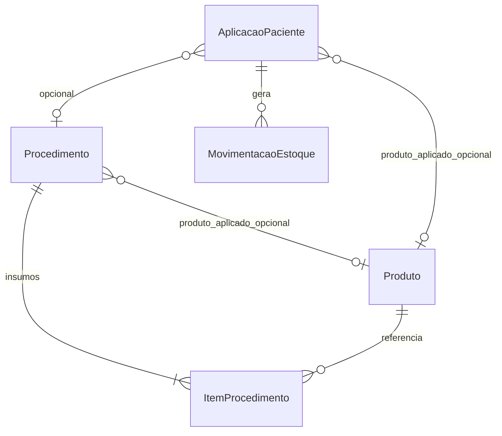

# Plano — Procedimentos, Aplicações e evolução de Estoque

Documento de planejamento revisado após alinhamento com o time.

**Status:** proposta para revisão (v3)  
**Data:** 2026-06-26  
**Contextos envolvidos:** `Applications` (procedimentos + aplicações), `Inventory` (movimentações, produto, recebimentos)

---

## 1. Problema

Hoje, ao registrar uma aplicação (`AplicacaoPaciente`), o sistema:

1. Grava qual **produto** foi aplicado no paciente (`produto_id`, `quantidade_utilizada`).
2. Gera **uma única saída** de estoque para esse produto.

Isso está correto clinicamente, mas **incompleto** operacionalmente: cada aplicação na prática também consome insumos (luva, agulha, seringa, álcool, etc.) que não entram no estoque.

### Comportamento desejado

O usuário pensa: **"Vou fazer uma aplicação."**

Na tela da aplicação, ele preenche **um dos dois** campos de busca:

```
Produto      [ Pesquisar produto...     ]
Procedimento [ Pesquisar procedimento... ]
```

Validação: **exatamente um** preenchido. Sem enum `modo` — só XOR entre `produtoId` e `procedimentoId`.

| O que foi selecionado | Saídas de estoque |
|-----------------------|-------------------|
| Produto | 1 saída — só o produto |
| Procedimento com produto aplicado | 1 saída do produto aplicado + 1 por insumo |
| Procedimento só com insumos | 1 saída por insumo (sem produto clínico) |

---

## 2. Visão geral — Procedimento

**Procedimento** = protocolo reutilizável por empresa. Dois blocos separados:

```
Procedimento
├── nome
├── produto_aplicado_id      ← opcional — o que o paciente recebe (clínico)
├── tempo_medio_minutos
├── preco_sugerido
├── observacoes
├── ativo
└── ItemProcedimento[]       ← apenas insumos consumidos
    ├── produto_id
    └── quantidade           ← fixa por execução
```

**Regra de ouro:** `ItemProcedimento` contém **somente insumos**. O produto aplicado **nunca** entra na lista de itens.

### Exemplo — aplicação com medicamento

| Bloco | Conteúdo |
|-------|----------|
| Nome | Aplicação Tirzepatida |
| Produto aplicado | Tirzepatida |
| Itens consumidos | Luva (2), Álcool (1), Seringa (1) |

### Exemplo — só insumos (sem produto aplicado)

| Bloco | Conteúdo |
|-------|----------|
| Nome | Curativo |
| Produto aplicado | *(vazio)* |
| Itens consumidos | Gaze, Luva, Soro, Fita |

| Bloco | Conteúdo |
|-------|----------|
| Nome | Limpeza de pele |
| Produto aplicado | *(vazio)* |
| Itens consumidos | Máscara, Algodão, Álcool |

Procedimentos sem produto aplicado preparam o sistema para estética e outros serviços que só consomem estoque, sem “dose” clínica.

---

## 3. Modelo de dados — Procedimento e Aplicação

### 3.1 `procedimento`

| Coluna | Tipo | Observação |
|--------|------|------------|
| `id` | `uniqueidentifier` | PK |
| `empresa_id` | `uniqueidentifier` | FK, tenant |
| `nome` | `nvarchar(200)` | Único por empresa |
| `produto_aplicado_id` | `uniqueidentifier` | **NULL** — FK `produto`; opcional |
| `tempo_medio_minutos` | `int` | Opcional |
| `preco_sugerido` | `decimal(18,2)` | Opcional |
| `observacoes` | `nvarchar(2000)` | Opcional |
| `ativo` | `bit` | |
| `criado_em` / `atualizado_em` | `datetime2` | |

Índice único: `(empresa_id, nome)`.

### 3.2 `item_procedimento`

| Coluna | Tipo | Observação |
|--------|------|------------|
| `id` | `uniqueidentifier` | PK |
| `procedimento_id` | `uniqueidentifier` | FK |
| `produto_id` | `uniqueidentifier` | FK — **somente insumos** |
| `quantidade` | `decimal(18,4)` | Consumo fixo por execução |

Índice único: `(procedimento_id, produto_id)`.

**Validação no cadastro:** `produto_id` de um item **não pode** ser igual a `produto_aplicado_id` do procedimento.

### 3.3 Alteração em `aplicacao_paciente`

| Coluna | Alteração |
|--------|-----------|
| `procedimento_id` | `uniqueidentifier NULL` |
| `produto_id` | Passa a **`NULL`** permitido |
| `quantidade_utilizada` | Passa a **`NULL`** permitido |

**Regras de preenchimento:**

| Origem | `procedimento_id` | `produto_id` | `quantidade_utilizada` |
|--------|-------------------|--------------|------------------------|
| Request com `produtoId` | `NULL` | do request | obrigatória (&gt; 0) |
| Request com `procedimentoId` e procedimento **tem** produto aplicado | do request | `procedimento.produto_aplicado_id` | obrigatória (&gt; 0) |
| Request com `procedimentoId` e procedimento **sem** produto aplicado | do request | `NULL` | `NULL` |

### 3.4 Diagrama



---

## 4. Aplicação — UX e API (sem `modo`)

### 4.1 Tela (conceito)

```
┌─ Nova aplicação ─────────────────────────────┐
│ Paciente, aplicador, unidade, data...         │
│                                               │
│ Produto      [ Pesquisar...              ]    │
│ Procedimento [ Pesquisar...              ]    │
│                                               │
│ Quantidade aplicada  [ 2,5 ]   ← só se houver produto │
│ ...                                           │
└───────────────────────────────────────────────┘
```

- Usuário preenche **um** dos dois campos de busca.
- Se escolheu procedimento **com** produto aplicado: exibe produto em readonly + campo de quantidade.
- Se escolheu procedimento **sem** produto aplicado (ex.: Curativo): oculta/desabilita quantidade aplicada.

### 4.2 Validação (backend)

```text
(produtoId preenchido XOR procedimentoId preenchido)
```

Mensagens:

- Nenhum: `"Informe o produto ou o procedimento."`
- Ambos: `"Informe apenas o produto ou o procedimento, não os dois."`

Se `procedimentoId` e o procedimento tem `produto_aplicado_id` → `quantidadeUtilizada` obrigatória.

Se `produtoId` no request → `quantidadeUtilizada` obrigatória.

Se procedimento sem produto aplicado → `quantidadeUtilizada` deve ser omitida ou `null`.

### 4.3 Request — só produto (retrocompatível)

```json
{
  "pacienteId": "uuid",
  "produtoId": "uuid",
  "aplicadorId": "uuid",
  "unidadeId": "uuid",
  "quantidadeUtilizada": 2.5,
  "dataAplicacao": "2026-06-26T10:00:00Z"
}
```

### 4.4 Request — procedimento com medicamento

```json
{
  "pacienteId": "uuid",
  "procedimentoId": "uuid",
  "aplicadorId": "uuid",
  "unidadeId": "uuid",
  "quantidadeUtilizada": 2.5,
  "dataAplicacao": "2026-06-26T10:00:00Z"
}
```

### 4.5 Request — procedimento só insumos

```json
{
  "pacienteId": "uuid",
  "procedimentoId": "uuid",
  "aplicadorId": "uuid",
  "unidadeId": "uuid",
  "dataAplicacao": "2026-06-26T10:00:00Z"
}
```

Sem `quantidadeUtilizada`. `produtoId` omitido.

---

## 5. Consumo de estoque na aplicação

Algoritmo único, sem regras especiais de deduplicação:

```
1. Se procedimento.produto_aplicado_id (ou produtoId direto) existe
      → saída do produto aplicado com quantidadeUtilizada

2. Para cada ItemProcedimento do procedimento
      → saída com item.quantidade (fixa)
```

Se aplicação foi por `produtoId` direto, só executa o passo 1.

### 5.1 Só produto

| Passo | Produto | Quantidade |
|-------|---------|------------|
| 1 | Produto selecionado | `quantidadeUtilizada` |

### 5.2 Procedimento com produto aplicado

**Exemplo** — dose 2,5 mg:

| Passo | Produto | Quantidade |
|-------|---------|------------|
| 1 | Tirzepatida (produto aplicado) | 2,5 (`quantidadeUtilizada`) |
| 2 | Luva | 2 |
| 2 | Seringa | 1 |
| 2 | Álcool | 1 |

Insumos **não escalam** com a dose.

### 5.3 Procedimento só insumos

**Exemplo** — Curativo:

| Passo | Produto | Quantidade |
|-------|---------|------------|
| 2 | Gaze | 1 |
| 2 | Luva | 2 |
| 2 | Soro | 1 |
| 2 | Fita | 1 |

Passo 1 não executa — não há produto aplicado.

### 5.4 Produto que não controla estoque

Produtos com `controla_estoque = false` **não geram** `MovimentacaoEstoque`, mas permanecem visíveis no cadastro e na aplicação.

### 5.5 Validação de saldo

Validar saldo apenas dos produtos com `controla_estoque = true` que terão saída.

Consulta em lote: `GetSaldosByUnidadeAndProdutosAsync`.

### 5.6 Cancelamento

Estornar **todas** as saídas vinculadas à aplicação (corrigir `CancelPatientApplicationsService`, que hoje estorna só o produto principal).

### 5.7 `CompraPaciente`

Vínculo com compra de pacote continua opcional e válido apenas quando `produto_id` está preenchido (aplicação com produto clínico).

---

## 6. Evolução de Produto

Campos adicionais em `produto`:

| Coluna | Tipo | Observação |
|--------|------|------------|
| `sku` | `nvarchar(50)` | Opcional; único por empresa se preenchido |
| `codigo_interno` | `nvarchar(50)` | Opcional; único por empresa se preenchido |
| `codigo_barras` | `nvarchar(50)` | Opcional (EAN/GTIN) |
| `controla_estoque` | `bit` | Default `true` |

### Regra `controla_estoque`

| Valor | Comportamento |
|-------|---------------|
| `true` | Saldo, validação, movimentações |
| `false` | Pode ser cadastrado no kit; **não** gera movimentação nem bloqueia por saldo |

---

## 7. Evolução de Movimentação — `motivo`

Hoje: `tipo` (Entrada/Saída) + `origem` (string).

Proposta: adicionar `motivo` (enum estruturado) para relatórios.

| Campo | Papel |
|-------|-------|
| `tipo` | Entrada ou Saída |
| `motivo` | Por que aconteceu |
| `origem` | Referência técnica (compatibilidade) |

### Enum `MotivoMovimentacaoEstoque`

**Entradas:** `Compra`, `Transferencia`, `Inventario`, `Ajuste`, `Devolucao`

**Saídas:** `Aplicacao`, `Perda`, `Validade`, `Inventario`, `Transferencia`, `ConsumoInterno`

> Fase 1 do roadmap — não bloqueia procedimentos.

---

## 8. Evolução de Pedido — Recebimento parcial

```
PedidoFornecedor → RecebimentoFornecedor (N) → MovimentacaoEstoque
```

Status do pedido: `Pendente` | `ParcialmenteRecebido` | `Recebido`.

> Fase 4 do roadmap.

---

## 9. API proposta

### 9.1 Procedimentos — `/api/procedures`

| Método | Rota | Descrição |
|--------|------|-----------|
| `GET` | `/api/procedures` | Lista (`ativo`, `nome`, `produtoAplicadoId`) |
| `GET` | `/api/procedures/{id}` | Detalhe com itens |
| `POST` | `/api/procedures` | Criar |
| `PUT` | `/api/procedures/{id}` | Atualizar |
| `PATCH` | `/api/procedures/{id}/deactivate` | Desativar |
| `PATCH` | `/api/procedures/{id}/reactivate` | Reativar |

**Body — procedimento com medicamento:**

```json
{
  "nome": "Aplicação Tirzepatida",
  "produtoAplicadoId": "uuid-tirzepatida",
  "tempoMedioMinutos": 30,
  "precoSugerido": 450.00,
  "observacoes": "Kit padrão subcutâneo",
  "itens": [
    { "produtoId": "uuid-luva", "quantidade": 2 },
    { "produtoId": "uuid-alcool", "quantidade": 1 },
    { "produtoId": "uuid-seringa", "quantidade": 1 }
  ]
}
```

**Body — procedimento só insumos:**

```json
{
  "nome": "Curativo",
  "produtoAplicadoId": null,
  "itens": [
    { "produtoId": "uuid-gaze", "quantidade": 1 },
    { "produtoId": "uuid-luva", "quantidade": 2 },
    { "produtoId": "uuid-soro", "quantidade": 1 },
    { "produtoId": "uuid-fita", "quantidade": 1 }
  ]
}
```

**Validações:**

- Nome obrigatório, único por empresa.
- Pelo menos um de: `produtoAplicadoId` **ou** 1+ item.
- Se `produtoAplicadoId` informado: produto ativo; **não pode** aparecer em `itens`.
- `quantidade > 0` em cada item; sem produto duplicado nos itens.

### 9.2 Aplicações — `/api/patient-applications`

**Request** — XOR `produtoId` / `procedimentoId`:

| Campo | Obrigatório | Regra |
|-------|-------------|-------|
| `produtoId` | XOR com `procedimentoId` | Produto ativo |
| `procedimentoId` | XOR com `produtoId` | Procedimento ativo |
| `quantidadeUtilizada` | Se há produto clínico | &gt; 0; omitir quando procedimento sem produto aplicado |

**Response:**

```json
{
  "produtoId": "uuid | null",
  "produtoNome": "string | null",
  "procedimentoId": "uuid | null",
  "procedimentoNome": "string | null",
  "quantidadeUtilizada": "number | null",
  "itensConsumidos": [
    { "produtoId": "uuid", "produtoNome": "Luva", "quantidade": 2, "controlaEstoque": true }
  ]
}
```

**Listagem** — filtro opcional: `procedimentoId`.

---

## 10. Onde vive o código

| Camada | Local |
|--------|-------|
| Domain | `ProcedimentoEntities.cs` |
| Domain | `AplicacaoEntities.cs` — `produto_id` e `quantidade_utilizada` nullable |
| Domain | `EstoqueEntities.cs` — `Produto`, `motivo`, recebimentos (fases posteriores) |
| Application | `Applications/Procedures/` |
| Application | `Applications/PatientApplications/` |
| WebApi | `Controllers/Procedures/`, ajustes em `PatientApplications` |

---

## 11. Regras de domínio

### Procedimento

1. Nome obrigatório, único por empresa.
2. `produto_aplicado_id` opcional.
3. Itens = **somente insumos**; `produto_aplicado_id` **proibido** na lista de itens.
4. Pelo menos `produto_aplicado_id` ou 1 item.
5. Desativar não apaga histórico.

### AplicacaoPaciente

1. XOR no request: `produtoId` ou `procedimentoId`.
2. Com procedimento e `produto_aplicado_id` → copia para `produto_id`; `quantidade_utilizada` obrigatória.
3. Com procedimento sem `produto_aplicado_id` → `produto_id` e `quantidade_utilizada` nulos.
4. Estoque: passo 1 (produto aplicado) + passo 2 (itens); sem deduplicação.
5. Movimentações só para `controla_estoque = true`.

---

## 12. Fases de implementação

### Fase 1 — Produto + motivo

- [ ] Campos extras em `Produto` + `controla_estoque`
- [ ] Enum `motivo` em `MovimentacaoEstoque`
- [ ] Migration `aplicacao_paciente`: `produto_id` e `quantidade_utilizada` nullable

### Fase 2 — Cadastro de procedimento

- [ ] `Procedimento` + `ItemProcedimento` (`produto_aplicado_id` opcional)
- [ ] CRUD `/api/procedures`
- [ ] Validação: produto aplicado ∉ itens

### Fase 3 — Aplicação com procedimento

- [ ] `procedimento_id` em `AplicacaoPaciente`
- [ ] XOR + algoritmo de estoque em 2 passos
- [ ] Cancelamento múltiplo
- [ ] `api-rotas-frontend.md`

### Fase 4 — Recebimento parcial

### Fase 5 — Refinamentos (preview estoque, relatórios, agenda)

---

## 13. Exemplo ponta a ponta

### Cadastrar — Tirzepatida

```http
POST /api/procedures
{
  "nome": "Aplicação Tirzepatida",
  "produtoAplicadoId": "…",
  "itens": [
    { "produtoId": "…luva", "quantidade": 2 },
    { "produtoId": "…seringa", "quantidade": 1 },
    { "produtoId": "…alcool", "quantidade": 1 }
  ]
}
```

### Aplicar — procedimento com medicamento

```http
POST /api/patient-applications
{
  "procedimentoId": "…",
  "quantidadeUtilizada": 2.5,
  ...
}
```

→ Saídas: Tirzepatida **2,5** | Luva **2** | Seringa **1** | Álcool **1**

### Cadastrar — Curativo

```http
POST /api/procedures
{
  "nome": "Curativo",
  "itens": [
    { "produtoId": "…gaze", "quantidade": 1 },
    { "produtoId": "…luva", "quantidade": 2 }
  ]
}
```

### Aplicar — só insumos

```http
POST /api/patient-applications
{
  "procedimentoId": "…",
  "pacienteId": "…",
  ...
}
```

→ Saídas: Gaze **1** | Luva **2** — sem passo do produto aplicado.

### Aplicar — só produto (como hoje)

```http
POST /api/patient-applications
{
  "produtoId": "…",
  "quantidadeUtilizada": 2.5,
  ...
}
```

→ 1 saída do produto.

---

## 14. Decisões fechadas (v3)

| # | Decisão |
|---|---------|
| 1 | Sem enum `modo` — XOR `produtoId` / `procedimentoId` |
| 2 | Itens = **somente insumos**; produto aplicado fora da lista |
| 3 | Sem deduplicação — algoritmo em 2 passos simples |
| 4 | `produto_aplicado_id` **opcional** no procedimento |
| 5 | `produto_id` e `quantidade_utilizada` **nullable** na aplicação |
| 6 | Insumos com quantidade fixa; dose só no produto aplicado |
| 7 | `controla_estoque` no produto |
| 8 | `motivo` nas movimentações (fase 1) |
| 9 | Recebimento parcial (fase 4) |

---

## 15. Riscos e mitigações

| Risco | Mitigação |
|-------|-----------|
| `produto_id` nullable quebra filtros/relatórios | Filtro `produtoId` retorna só aplicações com produto; filtro `procedimentoId` cobre curativos |
| `CompraPaciente` sem produto | Validar compra só quando `produto_id` preenchido |
| Procedimento sem produto e sem itens | Validação: pelo menos um dos dois no cadastro |
| Cancelamento parcial | Estornar todas as saídas em transação |

---

## Resumo executivo

O procedimento separa claramente **produto aplicado** (opcional, no cabeçalho) de **itens consumidos** (só insumos). Na aplicação, o estoque é gerado em dois passos lineares — produto aplicado com dose, depois cada insumo com quantidade fixa — sem regras especiais. Procedimentos como Curativo ou Limpeza de pele funcionam nativamente com `produto_aplicado_id` nulo, deixando o modelo pronto para estética e outros serviços sem aumentar a complexidade do código.
